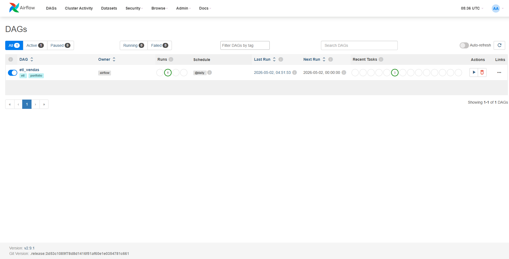
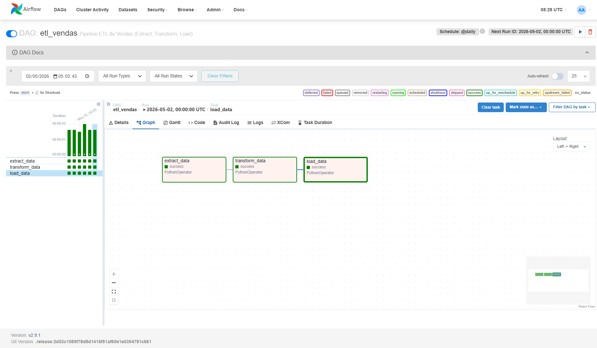

# Projeto de Engenharia de Dados: Pipeline ETL com Apache Airflow e PostgreSQL

Este repositorio contem uma solucao completa e conteinerizada para um pipeline de Extracao, Transformacao e Carga (ETL). O projeto foi desenhado utilizando padroes da industria para orquestracao de dados, demonstrando a integracao entre processamento em Python (Pandas) e armazenamento relacional estruturado (PostgreSQL), tudo gerenciado pelo Apache Airflow.

## 1. Arquitetura do Projeto

A infraestrutura foi totalmente construida sobre Docker e Docker Compose, garantindo isolamento e reprodutibilidade (o principio "funciona na minha maquina" e eliminado).

Componentes principais:

- Apache Airflow (Versao 2.9.1): Atua como o orquestrador principal, agendando e monitorando o fluxo de tarefas (DAGs).
- PostgreSQL (Source/Metadados): Banco de dados utilizado internamente pelo Airflow para gerenciar estado, usuarios e historico de execucao.
- PostgreSQL (Data Warehouse/Destino): Banco de dados analitico utilizado para armazenar o resultado final dos dados transformados pelo pipeline.
- Python 3.12: Motor de processamento de dados, utilizando a biblioteca Pandas para transformacoes em memoria.

## 2. Estrutura de Diretorios e Modularizacao

O codigo-fonte segue o padrao de arquitetura desacoplada, separando a logica de orquestracao da logica de negocio:

- dags/etl_dag.py: Define a DAG do Airflow. Nao contem logica de transformacao, apenas a declaracao de tarefas e suas dependencias.
- scripts/extract.py: Isola a responsabilidade de leitura dos dados brutos (CSV). Agora suporta a leitura dinâmica de múltiplos arquivos simultaneamente.
- scripts/transform.py: Centraliza todas as regras de negocio, higienizacao de dados e logica de tipagem.
- scripts/load.py: Gerencia as conexoes de rede e insercoes no banco de dados.
- docker-compose.yml: Define a rede interna (etl-network), volumes e os servicos.
- .env: Centraliza variaveis de ambiente e segredos (credenciais de banco e chaves do Airflow).

## 3. Regras de Negocio e Transformacoes

O pipeline executa uma limpeza rigorosa nos dados extraidos de todos os arquivos de origem localizados na pasta de entrada:

- Extracao Multi-Fonte: O sistema escaneia a pasta `data/` e processa todos os arquivos `.csv` encontrados de forma consolidada.

- Limpeza de Nulos: Registros com valores essenciais ausentes (como preco unitario) sao descartados silenciosamente.
- Tipagem e Formatacao: Datas sao validadas e padronizadas de forma rigida para o formato ISO (YYYY-MM-DD).
- Normalizacao de Texto: O status das transacoes e unificado, removendo acentuacoes e tornando tudo minusculo.
- Engenharia de Features: Calculo automatico do valor bruto e do valor com aplicacao de imposto, baseados na quantidade e no valor unitario.

## 4. Resiliencia e Idempotencia

O modulo de carga (load) foi projetado para ser 100% idempotente. Isso significa que a mesma DAG pode ser executada centenas de vezes consecutivas sem causar duplicacao de registros no banco de dados.
Foi implementada a logica de UPSERT nativa do PostgreSQL (ON CONFLICT DO NOTHING), atrelada a uma Primary Key (id). Adicionalmente, a insercao no banco e feita via conexao bruta (psycopg2) utilizando execucoes em lote (executemany) para alta performance, eliminando gargalos comuns de ORMs em grandes volumes.

## 5. Instrucoes de Execucao

### 5.1. Configuracao de Ambiente

Certifique-se de ter o Docker instalado e as portas 8080 e 5433 livres.
O arquivo .env ja esta pre-configurado para ambiente de desenvolvimento.

### 5.2. Inicializando os Servicos

No terminal, na raiz do projeto, execute o comando abaixo para provisionar e iniciar todos os componentes da infraestrutura:

```bash
docker-compose up -d
```

Aguarde aproximadamente 1 a 2 minutos para que o Airflow crie as tabelas internas e o banco de destino fique online.

### 5.3. Acessando a Interface do Airflow

Abra o navegador e acesse: http://localhost:8080
Credenciais de acesso padrao:

- Usuario: admin
- Senha: admin

### 5.3.1. Airflow



### 5.4. Executando o Pipeline

1. Na interface do Airflow, localize a DAG chamada "etl_vendas".
2. Remova a DAG do estado de "Pause" (clicando no interruptor ao lado do nome).
3. Acione a DAG manualmente clicando no botao "Trigger DAG" (simbolo de "Play").
4. Acompanhe os logs em tempo real atraves da aba "Graph" ou "Grid".

### 5.4.1. Airflow Pipeline Executado



## 6. Auditoria e Validacao de Dados

Apos a conclusao da execucao, voce tem duas formas de auditar os dados processados:

Validacao no Banco de Dados:
Acesse o banco PostgreSQL de destino diretamente pelo terminal do container para rodar consultas SQL:

```bash
docker exec -it etl_airflow_project-postgres-dest-1 psql -U etl_user -d etl_destino -c "SELECT * FROM vendas_transformadas;"
```

Validacao via Planilha Local:
A etapa de transformacao salva automaticamente uma copia de backup dos dados limpos no formato CSV, utilizando o separador ponto e virgula (compativel nativamente com Excel). O arquivo estara disponivel no caminho:
data/vendas_transformadas.csv

## 7. Encerramento

Para parar os servicos e limpar o ambiente (incluindo a exclusao dos dados salvos no banco de dados):

```bash
docker-compose down -v
```
